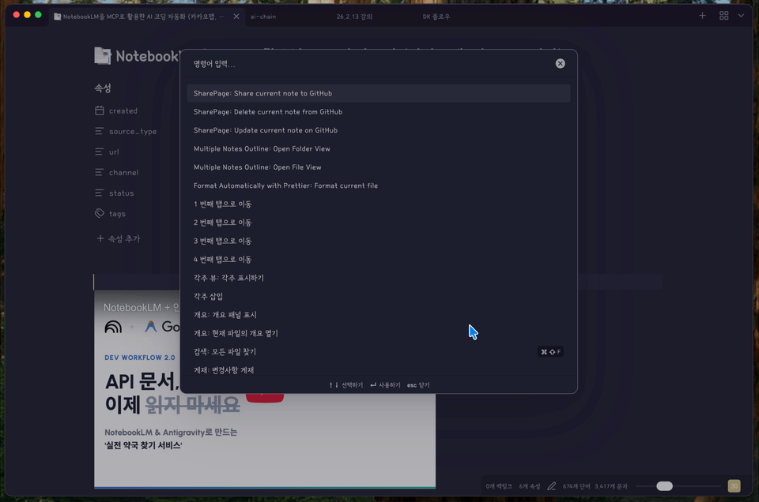

# SharePage

Obsidian 노트를 내 GitHub 저장소에 푸시하고 GitHub Pages를 통해 나만의 웹사이트로 공유할 수 있는 플러그인입니다.



## 🌟 주요 특징

- **하이브리드 렌더링**: SEO를 위한 서버 측 메타데이터 생성과 풍부한 인터랙션을 위한 브라우저 측 렌더링의 완벽한 조화
- **스마트 이미지 관리**: 문서 내의 `![[이미지]]`를 자동 감지하여 GitHub로 한 번에 업로드
- **콘텐트 매니저**: 공유된 노트 목록을 설정창에서 직접 확인하고 일괄 삭제 가능
- **실시간 배포 모니터링**: GitHub Actions의 진행 상태를 옵시디언 내부에서 실시간으로 확인 (Success/Fail 알림 및 알림음 지원)
- **클린 URL 지원**: 한글 제목 주소 유지 및 `.html` 확장자 제거를 통한 깔끔한 공유 링크
- **템플릿 동기화**: 개발자의 최신 웹 테마를 원클릭으로 내 저장소에 업데이트

## 🚀 빠른 시작

1.  **플러그인 설치**: [GitHub Releases](https://github.com/wis-graph/obsidian-sharepage/releases)에서 최신 파일을 다운로드하여 `.obsidian/plugins/sharepage` 폴더에 넣습니다.
2.  **설정**: 옵시디언 설정 → SharePage에서 **GitHub Token**을 생성하고 **Repository**를 선택합니다.
3.  **공유**: 노트를 우클릭하거나 명령 팔레트에서 `SharePage: Share current note to GitHub`를 실행합니다.
4.  **확인**: 배포 알림음이 울리면 클립보드에 복사된 URL로 접속합니다!

---

## ⚠️ 주의사항 (Important Notes)

-   **배포 딜레이**: 이 플러그인은 GitHub Actions를 통해 사이트를 빌드합니다. 따라서 노트를 공유한 후 실제 웹사이트에 반영되기까지 **약 1~2분의 지연 시간**이 발생할 수 있습니다. (설정창의 'Deployment Status'에서 실시간 상태를 확인할 수 있습니다.)
-   **첫 배포**: 저장소를 처음 만들고 게시하는 경우 GitHub Pages 설정이 활성화되는 데 시간이 조금 더 걸릴 수 있습니다.

## 📂 파일 구조 (Architecture)

### Obsidian Plugin (Core)
```
src/
├── core/
│   ├── logic/           # 변환 로직 (YouTube, Metadata 등)
│   ├── github/          # GitHub API 서비스
│   ├── note-publisher.ts # 게시 총괄 서비스
│   └── deployment-monitor.ts # 배포 모니터링
├── settings-tab.ts      # 설정 UI
└── main.ts              # 플러그인 엔트리
```

### Web Template (Frontend)
```
sharepage-template/
├── index.html           # SPA 셸
├── js/
│   ├── controllers/     # MVC 컨트롤러
│   ├── services/        # 렌더링(Markdown, Mermaid, Math) 서비스
│   └── themes/          # 다크/라이트 모드 관리
└── notes/               # 업로드된 .md 원본 저장소
```

## 🛠 사용 가이드

더 자세한 설정 방법과 고급 팁은 [사용자 가이드(USER_GUIDE.md)](./USER_GUIDE.md)를 참고하세요.

## ✅ 완료된 기능

- [x] 실시간 배포 상태 모니터링 및 완료 알림음
- [x] 공유 콘텐트 일괄 관리 및 삭제 (Content Management UI)
- [x] 유튜브 링크 자동 감지 및 📺 이모티콘 메타데이터 처리
- [x] 클린 URL 지원 (한글 주소 및 확장자 제거 지원)
- [x] 이미지 바이너리 자동 업로드 및 동기화

## 🚧 예정된 기능

- [ ] 폴더 단위 대량 공유 기능 (?)
- [ ] 커스텀 도메인 설정 도우미

## 📄 라이선스

MIT License
